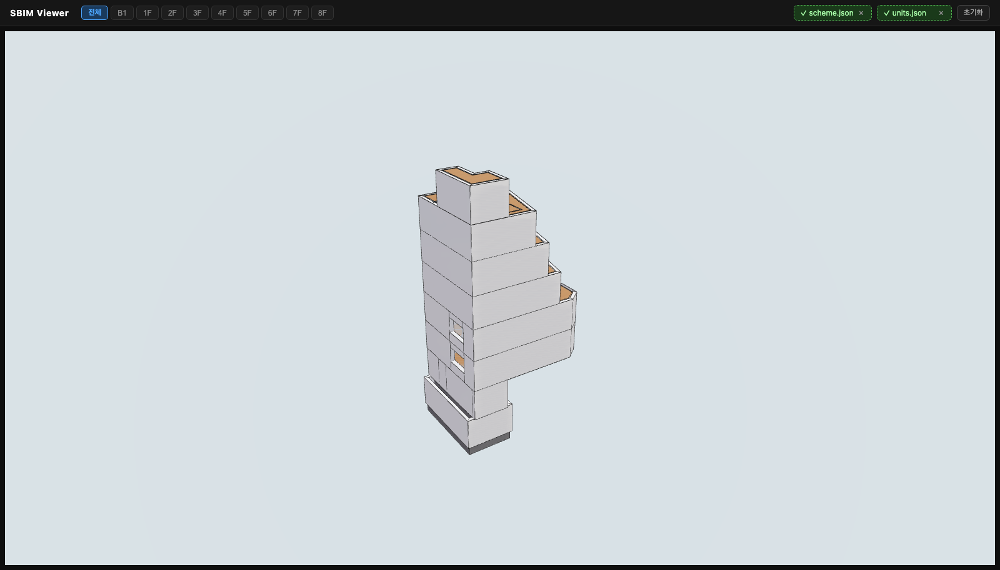
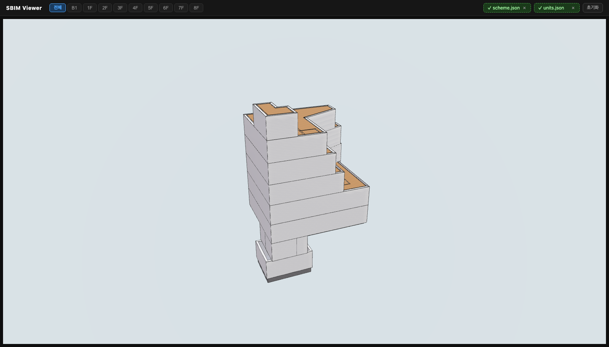
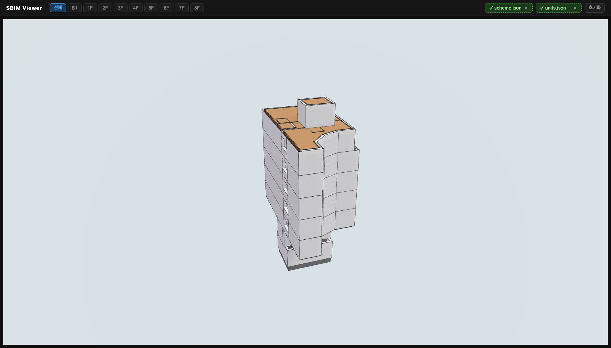
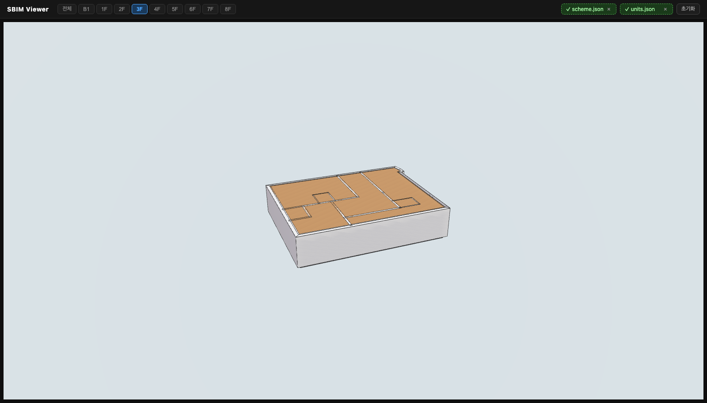
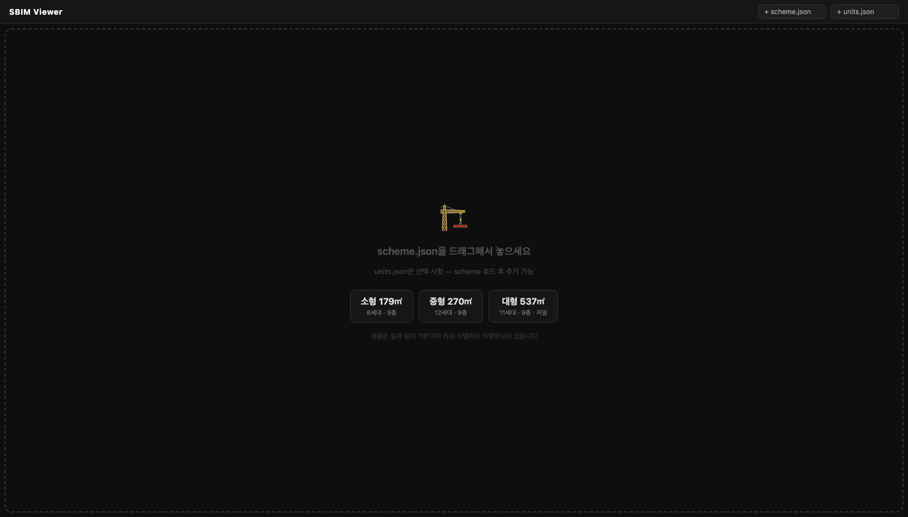

# sbim — Seoulgaok BIM Core

서울가옥 BIM 데이터 모델·연산·시각화 공통 패키지.

`scheme.json`을 단일 진실로 하여 Python·TypeScript·React 시각화를 통합합니다.

---

## 사례

`scheme.json` 하나로 3D 매스·층별 평면·세대 분할이 그대로 재현됩니다.
아래는 실제 필지로 생성한 결과이며, 좌표·식별자·금액은 익명화되어 있습니다.

| 소형 179㎡ · 8세대 | 중형 270㎡ · 12세대 | 대형 537㎡ · 11세대 |
|---|---|---|
|  |  |  |

계단처럼 깎여 올라가는 상층부는 **정북방향 일조권 사선제한**의 결과입니다.
왼쪽 두 사례는 용적률을 한계까지 채우며 사선을 따라 깎였고, 오른쪽은
용적률 여유가 있어(FAR 102) 사선에 덜 눌린 매스로 섭니다.

**층별 보기** — 상단 층 탭으로 한 층만 떼어 볼 수 있습니다. 천장을 걷어내고
내부 벽·실 구획·창 개구부를 들여다봅니다.



**직접 보기** — 뷰어를 띄우면 시작 화면에서 샘플을 바로 불러올 수 있습니다.

```bash
pnpm install && pnpm dev
```



`?sample=sample-medium&floor=3` 처럼 URL로 바로 열 수도 있습니다.

---

## 사용 프로젝트

```
생성기 (Python)
    ↓ scheme.json 생성
    │
    ├── python/seoulgaok_bim_core
    │       Scheme, FloorPlan, Unit dataclass + io
    │
    ├── typescript/                    ← 프론트엔드
    │       동일 타입 + operations
    │
    └── visualizer/                    ← 프론트엔드
            BuildingMeshVisualizer (R3F)
```

---

## 디렉토리 구조

```
sbim/
├── schema/                    # 단일 진실 — JSON Schema
│   ├── scheme.schema.json
│   ├── units.schema.json
│   └── surroundings.schema.json
├── python/                    # Python 패키지 (pip install -e .)
│   └── seoulgaok_bim_core/
│       ├── types.py           # pydantic 모델
│       ├── options.py         # BuildOptions (설계 의도)
│       ├── io.py              # load/save
│       ├── config.py          # 사업 설정값 오버레이
│       ├── site_filter.py     # 필지 선별 구조
│       └── ifc.py             # IFC4 내보내기 (건축)
├── typescript/                # TS 패키지 (@seoulgaok/bim-core)
│   └── src/
│       ├── types.ts
│       ├── io.ts
│       ├── operations.ts
│       └── geometry.ts        # convertToThreeGeometry
├── visualizer/                # React + R3F (@seoulgaok/bim-visualizer)
│   └── src/
│       ├── BimCanvas.tsx
│       └── hooks/useBuildingData.ts
├── viewer/                    # 드래그앤드롭 뷰어 (샘플 내장)
├── sbim-editor/               # Tauri 평면도 벡터 에디터
└── examples/samples/          # 샘플 scheme.json, units.json
```

---

## 설치

### Python
```bash
pip install -e ./python
pytest python/tests
```

### TypeScript / 뷰어 (pnpm workspace)
루트에서 한 번 설치하면 `typescript` · `visualizer` · `viewer`가 서로 연결됩니다.

```bash
pnpm install
pnpm build            # 3개 패키지 전부
pnpm dev              # 뷰어 개발 서버
```

외부 프로젝트에서 쓸 때:
```json
{
  "dependencies": {
    "@seoulgaok/bim-core": "file:../sbim/typescript",
    "@seoulgaok/bim-visualizer": "file:../sbim/visualizer"
  }
}
```

### 에디터 (Tauri, 별도 npm 프로젝트)
```bash
cd sbim-editor && npm ci && npm run build
```

---

## IFC 내보내기

`scheme.json` + `units.json` → **IFC4** 파일. 아키캐드·레빗·BIM 뷰어에서 엽니다.

```bash
pip install -e "./python[ifc]"      # ifcopenshell (선택 의존)
```

```python
import json
from seoulgaok_bim_core import generate_ifc

scheme = json.load(open("examples/samples/sample-medium/scheme.json"))
units  = json.load(open("examples/samples/sample-medium/units.json"))
generate_ifc(scheme, units, out_path="out.ifc")
```

뷰어가 그리는 바로 그 삼각 메시를 `IfcTriangulatedFaceSet`으로 1:1 변환하므로
화면과 IFC가 어긋나지 않습니다. 세대는 `IfcSpace`로 나가고 `NetFloorArea`
수량이 붙어 적산에 바로 쓸 수 있습니다.

중형 샘플 기준 산출물:

| 요소 | 개수 | | 요소 | 개수 |
|---|---:|---|---|---:|
| IfcBuildingStorey | 9 | | IfcMember (난간살·계단) | 920 |
| IfcWall | 131 | | IfcStair | 7 |
| IfcSlab | 15 | | IfcSpace (세대·코어실) | 28 |
| IfcWindow / IfcDoor | 24 / 24 | | IfcColumn / IfcBeam | 4 / 22 |

`parcel_center`를 넘기지 않으면 scheme의 절대좌표에서 추정합니다.
파이프라인이 값을 들고 있으면 그쪽이 정확하니 명시하세요.

**범위 — 건축 모델만.** 설비(우수·오수·급수 계통, 위생기구)는 욕실·주방
배치에서 계통을 derive하는 별개 문제이고, 분야별 모델을 나누는 실무 관행상
으로도 다른 모델입니다. 이 저장소에서는 다루지 않습니다.

---

## 사업 설정값 (금융 조건 등)

구조는 저장소에, **값은 저장소 밖에.** 사업자·시점마다 달라지는 값은
`sbim_config.json`에서 주입합니다 (`.gitignore` 대상).

```bash
cp examples/sbim_config.example.json ./sbim_config.json
# 또는
export SBIM_CONFIG=/path/to/sbim_config.json
```

```python
from seoulgaok_bim_core import build_options
opts = build_options()                              # 설정 파일 적용
opts = build_options(financing={"land_loan_ltv": 0.7})   # 인자가 우선
```

우선순위는 `kwargs` > 설정 파일 > 모델 기본값. `BuildOptions(...)`를 직접
쓰면 설정 파일이 무시되므로 `build_options()`를 쓰세요.

`Financing`의 금융 조건에는 **기본값이 없습니다(None).** 남의 협상 조건을
조용히 물려받아 사업성을 계산하는 게 값이 비는 것보다 위험해서입니다.
계산 직전 `opts.financing.require("land_loan_ltv", ...)`를 호출하면
어느 값이 비었는지 밝히고 중단합니다.

---

## 필지 선별 기준 설정

`site_filter`는 **구조만** 제공하고 임계값은 저장소에 두지 않습니다.
`examples/site_filter.example.json`을 복사해 값을 채우고 경로를 지정하세요.

```bash
cp examples/site_filter.example.json ./site_filter.json
# 또는
export SBIM_SITE_FILTER=/path/to/site_filter.json
```

```python
from seoulgaok_bim_core import build_site_where
where, params = build_site_where(alias="l")          # 설정 파일에서 로드
where, params = build_site_where(criteria={...})     # 직접 주입
```

설정이 없으면 `SiteFilterNotConfigured`가 발생합니다 — 조용한 기본값을 두지
않는 건, 빠진 설정이 "전체 필지 조회"로 흘러가는 편이 더 위험하기 때문입니다.

---

## 데이터 모델 (요약)

```
Scheme
├── data: { lot_area, build_area, far, bcr, pnu }
├── floor_plans[]: FloorPlan
│   ├── data: { floor_id, floor_area, floor_height, floor_bottom_height }
│   └── geom: { walls, floors, roof? }
└── unit_ids[]

Unit
├── geom: { boundary }
└── data: { id, name, price, floor_id, area_net, area_common, ... }

Surroundings (배열)
├── geom: { boundary }
└── data: { address, height, floor }
```

---

## 단일 진실 원칙

1. JSON Schema가 **유일한 정의**. Python·TS 타입은 여기서 생성.
2. 같은 데이터를 양쪽이 다르게 정의하지 않는다.
3. 필드 추가 시 schema 먼저 수정 → 양쪽 코드 갱신.

---

## 향후 단계

- [ ] schema/scheme.schema.json 정식 작성
- [ ] Python/TS 타입 자동 생성 파이프라인 (datamodel-code-generator, json-schema-to-typescript)
- [ ] operations 함수 (move_core, set_unit_count, set_floor_type, ...)
- [ ] visualizer 이식 (프론트엔드 → 패키지)
- [ ] LoD 200 룰 (건축사 합류 후)
- [x] IFC export (건축) — `generate_ifc`
- [ ] IFC import (IFC → scheme) — 미착수

---

## 라이선스

[Apache License 2.0](LICENSE) — 상업적 이용을 포함해 자유롭게 사용·수정·재배포할 수 있습니다.

재배포 시 라이선스 사본과 `NOTICE` 파일을 포함해야 하며, 변경한 파일은 변경 사실을 표시해야 합니다.
기여자 특허 라이선스가 포함되어 있어, 채택하는 쪽이 특허 리스크 없이 쓸 수 있습니다.
